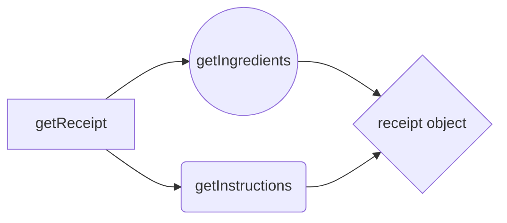

Asynchronous JavaScript: The Recipe Challenge
==============

  

Welcome to the first challenge of boothack community 🥳 👋🏻 

  

**The Goal:** 🎯
==============

  

Imagine you're building a simple recipe app. You have access to two APIs:

  

-  **`getIngredients(recipeName)`:** This function fetches a list of ingredients for a specific recipe.

-  **`getInstructions(recipeName)`:** This function fetches the cooking instructions for a specific recipe.

  

Your mission is to create a function called `getRecipe(recipeName)` that does the following:

  

1.  **Fetches the ingredients and instructions:** This means making both API calls to get a composed APIs responses into one receipt object.

2.  **Handles potential errors gracefully:** If one or both API calls fail, your function should handle these errors and provide an appropriate response.

3.  **Returns a complete recipe object:** If successful, your function should return an object containing both the ingredients and instructions for the requested recipe.

  

**Flow Diagram:** 🔁
==============

  

  

**Instructions:** 📝
==============

  

1.  **Set up:**

	- Create function implementation of getRecipe function

	- You'll be working with the provided `getIngredients()` and `getInstructions()` functions (see below). These functions are designed to simulate API calls and include a slight delay for demonstration purposes.

2.  **Implement the `getRecipe()` function:**

	- Use then/catch or async/await to execute both API calls.

	- Employ try...catch blocks to handle any errors that might occur during the API calls.

	- If an error happens in either API call, log the error message to the console and return `null` to indicate the recipe was not fetched successfully.

	- If both API calls succeed, combine the `ingredients` and `instructions` into a `recipe` object and return it.

3.  **Test Your Solution:** 🧪

	- Call the `getRecipe()` function with a recipe name (e.g., "Spaghetti Carbonara").

	- Log the result to the console to verify that the complete `recipe` object is returned.

  

4.  **bonus points:** 🌟

	- Add the receipt name in console when returning the entire instructions and ingredients

	- Execute both API calls concurrently to make the function much more efficient

	- Suscribe to the discord community 👉🏻 https://discord.gg/6YZGTxSFUX

  

**How to provide your challenge solution:** 📦
==============

  

1. Join the community: If you haven't already, join our Discord/Forum to share your progress and get feedback.

2. Get the code base provided: Everything you need to know is right here 👉 https://github.com/gonzalogcontacto/js-challenge-1/blob/main/main.js.

3. Upload your solution: Send your code as a PR to the GitHub repo via private message to Gonzalo (on discord) before December 2.

4. (optional) Share your experience: Post your progress on social media using the hashtag #RetoCodigoBootHack so we can see you in action and mention @boothackTV.

**What can you win?** 🎁
==============

As well as improving your skills and connecting with our amazing community, we have some great prizes up for grabs! 👇

🥇 **Best Code Prize**: 1:1 Individual Coaching with @gonzalogcontacto (the boohtack founder)